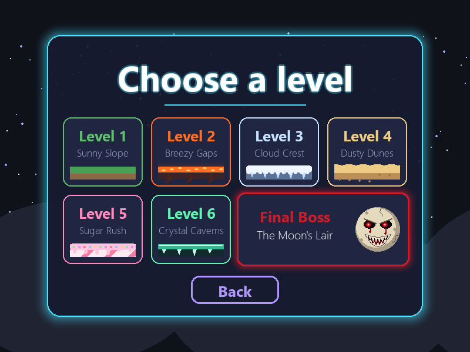
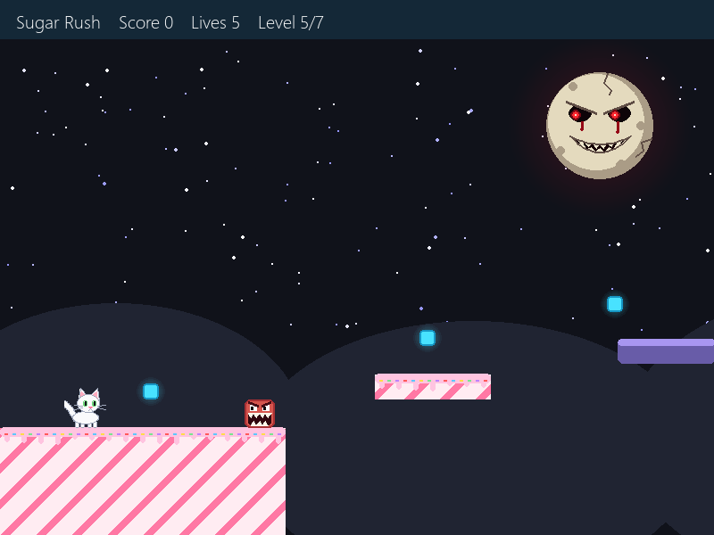
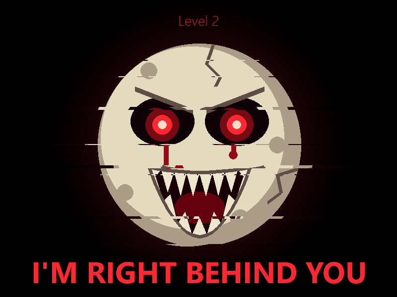
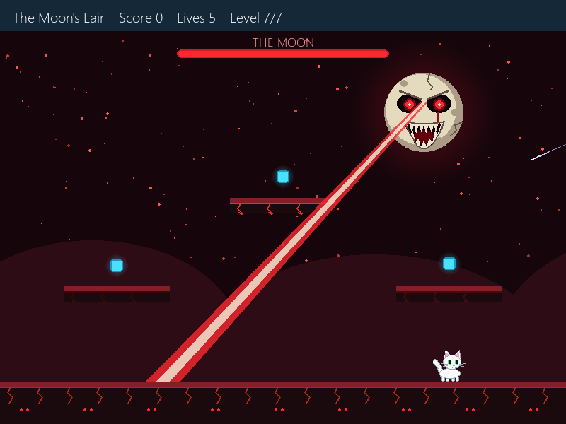
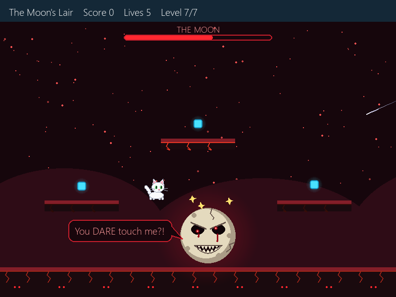
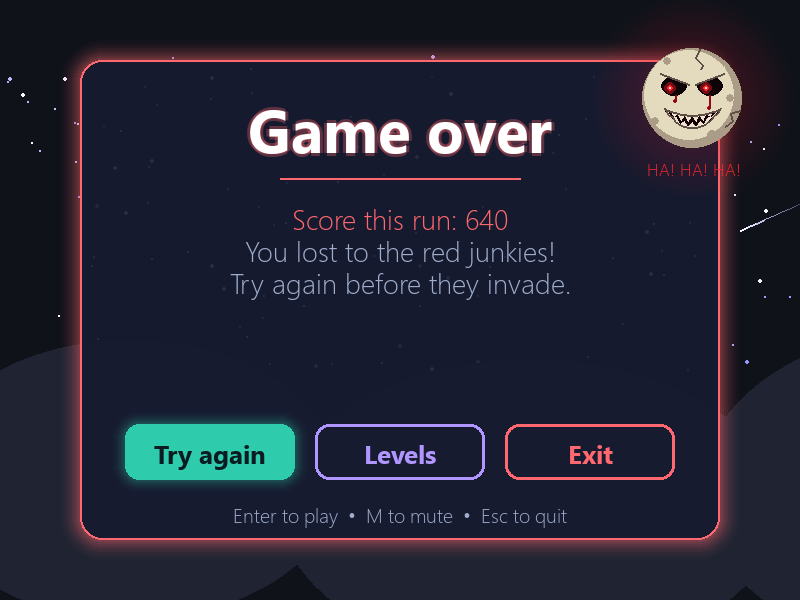

# The Red Moon

A tiny original horror platformer written in Python with [Pygame](https://www.pygame.org/).
Play as a little white cat crossing six haunted hills while a blood-red Moon watches from the sky.
It follows you with glowing eyes, whispers threats and laughs every time you die, jumpscares you
between levels, and waits for you at the end in a final boss fight.


## Screenshots

| Start screen | Choose a level | Level 5: Sugar Rush |
| --- | --- | --- |
|  |  |  |

| Jumpscare | Boss fight: eye laser | Boss fight: stomp it while it's dizzy |
| --- | --- | --- |
|  |  |  |

| Game over | Victory |
| --- | --- |
|  |  |

## Features

- **The Red Moon**: a cracked, bleeding moon with glowing eyes that track you and a grin full of teeth.
  Every time you die it flashes the screen red, **laughs an evil laugh** and whispers one of 60+ creepy lines,
  with extra lines for each level's theme.
- **Jumpscares between levels**: the lights go out, the Moon lunges at the screen and **says its line out loud**
  in a deep, growling voice ("I SEE YOU", "I'M RIGHT BEHIND YOU"...), then laughs.
- **Final boss fight** against the Moon itself. Dodge spat teeth, a tracking eye laser, meteor showers and
  summoned monsters, then stomp it when it crashes down dizzy. Five hits wins it, and it gets angrier and
  faster as it weakens.
- **Scary background music**: a creepy music-box lullaby with a heartbeat for the levels, and a faster,
  pounding track for the boss.
- **7 levels**, each with its own floor: grass, lava, snow, sand, candy, glowing crystals, and the Moon's lair.
- **Level select** screen so you can jump straight to any level, including the boss.
- **Play as a white cat** that blinks, swishes its tail, walks and turns to face where it's going.
- **Double jump**: press jump again in mid-air (stomping an enemy gives it back).
- **Chomping red monsters** that chomp faster when you get close; they move faster in later levels.
- **Moving platforms** (purple) that slide or rise and fall, and carry you along.
- A drifting, twinkling star sky with shooting stars, plus sparkles, bursts, floating scores and screen shake.
- Clickable **Play / Levels / Exit** menus, 5 lives, and points for coins, stomps and beating the Moon.
- **One file, no asset files.** All graphics, music and sound effects are generated in code.

## Getting started

You need **Python 3.8+**.

```bash
git clone https://github.com/yugdogra0/sky-hill.git
cd sky-hill
pip install -r requirements.txt
python game.py
```

The Moon's spoken lines and laughs use the text-to-speech voice built into **Windows**. On other systems
the game still runs with all music and sound effects; the jumpscares just play without the voice.

## Controls

| Action | Keys / mouse |
| --- | --- |
| Move | `Left` / `Right` or `A` / `D` |
| Jump | `Space`, `Up` or `W` |
| Double jump | Press jump again while in the air |
| Start / play again | Click **Play** (or press `Enter`) |
| Pick a level | Click **Levels**, then a level card (`Esc` goes back) |
| Mute / unmute | `M` |
| Quit | Click **Exit** (or press `Esc`) |

## How to play

- Reach the **flag pole** at the end of each hill to move on to the next one. Brace yourself for the Moon.
- Collect **glowing coins** for 10 points each.
- Jump on a **red monster** from above to stomp it for 50 points. Touching one from the side costs a life.
- Stand on a **purple platform** to ride it across gaps or up to higher ledges.
- Falling off the map costs a life and restarts the level. Lose all 5 lives and it's game over.

### Beating the Moon

- The Moon floats above the arena and cycles through its attacks:
  - **Tooth spit**: volleys of teeth aimed at you.
  - **Eye laser**: a thin red line locks on to you, then a huge beam fires. Move once the line stops following you.
  - **Meteor rain**: fireballs fall where the glowing shadows are. Platforms block them.
  - **Summon**: two red monsters join the fight (stomp them for points).
- After three attacks it shakes, **dives at you** and crashes down dizzy. **Jump on top of it** before it floats back up.
- Five hits defeats it for **+500 points**. The damage you deal is kept even if you lose a life.

## Tweaking the game

All the game-feel settings are constants at the top of `game.py`:

```python
MOVE_SPEED = 6           # how fast the cat runs
GRAVITY = 0.62           # how quickly the cat falls
JUMP_VEL = -13.2         # jump strength (more negative = higher)
DOUBLE_JUMP_VEL = -11.5  # strength of the mid-air jump
AIR_JUMPS = 1            # mid-air jumps allowed (set to 2 for a triple jump)
START_LIVES = 5
BOSS_HP = 5              # hits needed to defeat the Moon
MUSIC_VOLUME = 0.45
```

The Moon's dialogue lives in `MOON_LINES`, the jumpscare lines in `SCARE_LINES` and its laughs in `LAUGHS`.
Levels are plain Python data in `make_levels()`, so you can add platforms, coins and enemies by editing the
lists there. Each level has a `"theme"`: `"grass"`, `"lava"`, `"snow"`, `"sand"`, `"candy"`, `"crystal"` or `"lair"`.
Moving platforms are listed under `"movers"` as `(x, y, width, height, axis, distance, speed)`,
where `axis` is `"x"` (side to side) or `"y"` (up and down).

## Project structure

```
sky-hill/
├── game.py            # the whole game
├── requirements.txt   # pygame dependency
├── screenshots/       # images used in this README
└── README.md
```
