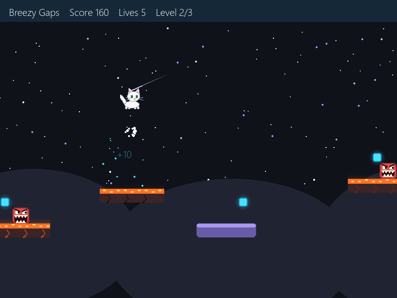

# Sky Hill

A tiny original side-scrolling platformer written in Python with [Pygame](https://www.pygame.org/).
Play as a little white cat under a moving, starry night sky: double jump across gaps, ride moving
platforms, stomp the chomping red monsters, collect glowing coins, and reach the flag on all three hills.


## Screenshots

| Start screen | Level 2: lava | Level 3: snow | Victory |
| --- | --- | --- | --- |
|  |  |  |  |

## Features

- **Play as a white cat** that blinks, swishes its tail, walks and turns to face where it's going
- **Double jump**: press jump again in mid-air for an extra boost (stomping an enemy gives it back)
- **Chomping red monsters** with snapping teeth that chomp faster when you get close
- **Stomp enemies** by landing on them from above for 50 points and a bounce
- **Moving platforms** (purple) that slide side to side or rise and fall, and carry you along
- **A different floor on every level**: grass on level 1, glowing lava on level 2, snow and icicles on level 3
- **A living night sky**: stars that drift and twinkle, plus the occasional shooting star
- Glowing, bobbing cyan coins worth 10 points each
- Game feel effects: coin sparkles, enemy bursts, double-jump puffs, floating score numbers and screen shake
- **Clickable menus** with Play and Exit buttons on the start, game over and victory screens
- 5 lives, and a max score of **720** (27 coins × 10 + 9 monsters × 50)
- Single file, no assets needed. Everything is drawn in code.

## Getting started

You need **Python 3.8+**.

```bash
git clone https://github.com/yugdogra0/sky-hill.git
cd sky-hill
pip install -r requirements.txt
python game.py
```

## Controls

| Action | Keys / mouse |
| --- | --- |
| Move | `Left` / `Right` or `A` / `D` |
| Jump | `Space`, `Up` or `W` |
| Double jump | Press jump again while in the air |
| Start / play again | Click **Play** (or press `Enter`) |
| Quit | Click **Exit** (or press `Esc`) |

## How to play

- Reach the **flag pole** at the end of each hill to move on to the next one.
- Collect **glowing coins** for 10 points each.
- Jump on a **red monster** from above to stomp it for 50 points. Touching one from the side costs a life.
- Stand on a **purple platform** to ride it across gaps or up to higher ledges.
- Use your **double jump** to cross wide gaps or fix a mistimed jump.
- Falling off the map costs a life and restarts the level.
- Lose all 5 lives and it's game over. Clear all three hills to win.

## Tweaking the game

All the game-feel settings are constants at the top of `game.py`:

```python
MOVE_SPEED = 6           # how fast the cat runs
GRAVITY = 0.62           # how quickly the cat falls
JUMP_VEL = -13.2         # jump strength (more negative = higher)
DOUBLE_JUMP_VEL = -11.5  # strength of the mid-air jump
AIR_JUMPS = 1            # mid-air jumps allowed (set to 2 for a triple jump)
START_LIVES = 5
STOMP_BOUNCE = -10       # bounce height after stomping an enemy
STOMP_POINTS = 50
COIN_POINTS = 10
```

Levels are plain Python data in `make_levels()`, so you can add platforms, coins and enemies
by editing the lists there. Each level has a `"theme"` of `"grass"`, `"lava"` or `"snow"`.
Moving platforms are listed under `"movers"` as `(x, y, width, height, axis, distance, speed)`,
where `axis` is `"x"` (side to side) or `"y"` (up and down).

## Project structure

```
sky-hill/
├── game.py            # the whole game
├── requirements.txt   # pygame dependency
├── screenshots/       # images used in this README
└── README.md
```
