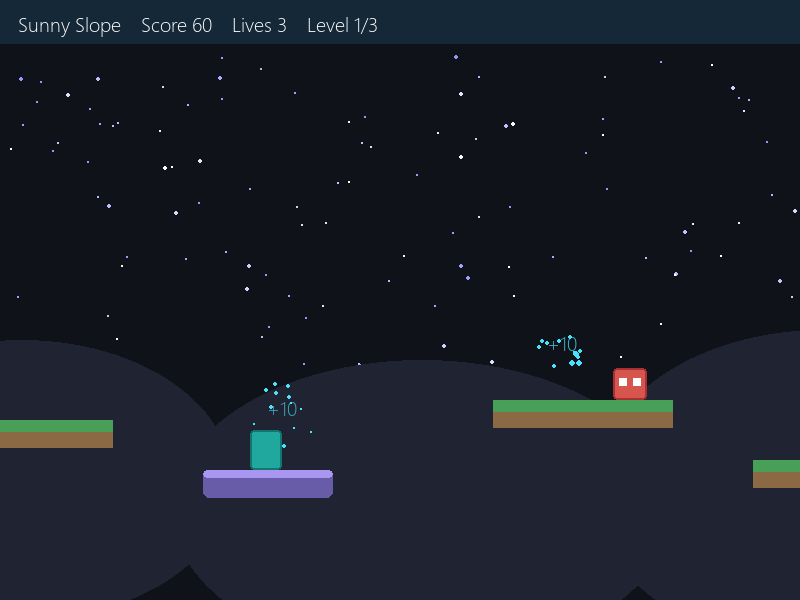
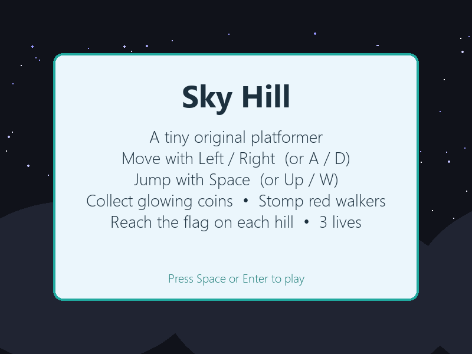
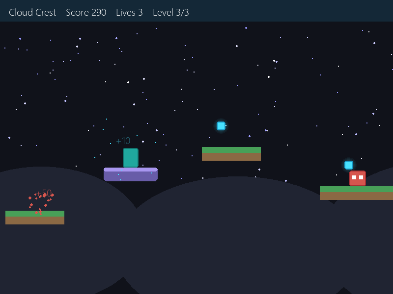
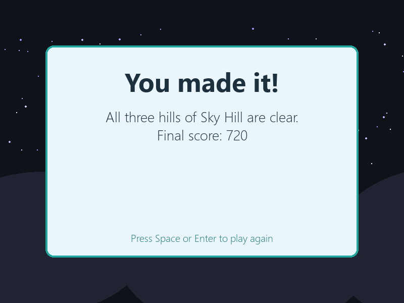

# Sky Hill

A tiny original side-scrolling platformer written in Python with [Pygame](https://www.pygame.org/).
Run and jump under a starry night sky, ride moving platforms, stomp the red walkers, collect glowing
coins, and reach the flag on all three hills.



## Screenshots

| Start screen | Level 3: Cloud Crest | Victory |
| --- | --- | --- |
|  |  |  |

## Features

- Three hand-built levels: **Sunny Slope**, **Breezy Gaps** and **Cloud Crest**
- **Stomp enemies** by landing on them from above for 50 points and a bounce
- **Moving platforms** (purple) that slide side to side or rise and fall, and carry you along
- Glowing, bobbing cyan coins worth 10 points each
- A night sky with twinkling parallax stars and a smooth side-scrolling camera
- Game feel effects: coin sparkles, enemy bursts, floating score numbers and screen shake
- 3 lives, with start, game over and victory screens
- Max score of **720** (27 coins × 10 + 9 walkers × 50)
- Single file, no assets needed. Everything is drawn with shapes.

## Getting started

You need **Python 3.8+**.

```bash
git clone https://github.com/yugdogra0/sky-hill.git
cd sky-hill
pip install -r requirements.txt
python game.py
```

## Controls

| Action | Keys |
| --- | --- |
| Move | `Left` / `Right` or `A` / `D` |
| Jump | `Space`, `Up` or `W` |
| Start / play again | `Space` or `Enter` |
| Quit | `Esc` |

## How to play

- Reach the **flag pole** at the end of each hill to move on to the next one.
- Collect **glowing coins** for 10 points each.
- Jump on a **red walker** from above to stomp it for 50 points. Touching one from the side costs a life.
- Stand on a **purple platform** to ride it across gaps or up to higher ledges.
- Falling off the map costs a life and restarts the level.
- Lose all 3 lives and it's game over. Clear all three hills to win.

## Tweaking the game

All the game-feel settings are constants at the top of `game.py`:

```python
MOVE_SPEED = 7       # how fast the player runs
GRAVITY = 0.62       # how quickly the player falls
JUMP_VEL = -13.2     # jump strength (more negative = higher)
START_LIVES = 3
STOMP_BOUNCE = -10   # bounce height after stomping an enemy
STOMP_POINTS = 50
COIN_POINTS = 10
```

Levels are plain Python data in `make_levels()`, so you can add platforms, coins and enemies
by editing the lists there. Moving platforms are listed under `"movers"` as
`(x, y, width, height, axis, distance, speed)`, where `axis` is `"x"` (side to side) or `"y"` (up and down).

## Project structure

```
sky-hill/
├── game.py            # the whole game
├── requirements.txt   # pygame dependency
├── screenshots/       # images used in this README
└── README.md
```
